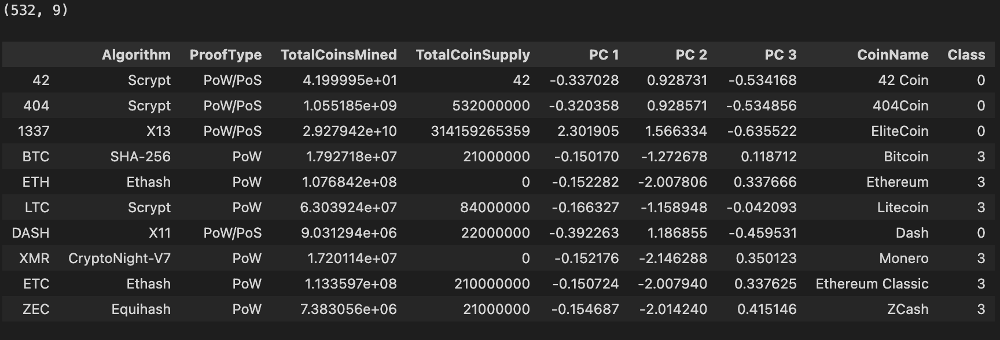

# Cryptocurrencies

# Overview

This project implements unsupervised machine learning to create an analysis for prospective clients preparing to dive into the cryptocurrency market

# Results:

# Original DataFrame

# Table

# New DataFrame

# Scatter Plot

